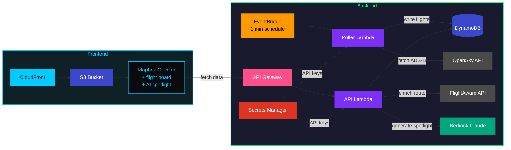

# SkyWatch — PyCon 2026 Booth Demo

A live AI-narrated flight tracker for the airspace above PyCon, deployed with Python CDK.

## Architecture



## Setup

### Prerequisites

- AWS CDK CLI (`npm install -g aws-cdk`)
- Python 3.12+
- API keys:
  - [OpenSky Network](https://opensky-network.org/) — free account for ADS-B position data
  - [FlightAware AeroAPI](https://www.flightaware.com/aeroapi/signup/personal) — Personal tier ($5/mo free credit) for route enrichment
  - [Mapbox](https://account.mapbox.com/auth/signup/) — free tier for map rendering

### Deploy

```bash
cd skywatch
python -m venv .venv
source .venv/bin/activate
pip install -r requirements.txt
cdk deploy
```

## Cost

- OpenSky: Free
- FlightAware: ~$20 for 3-day conference (Personal tier)
- Mapbox: Free (well under 50k map loads)
- AWS: Minimal (Lambda + DynamoDB + S3/CloudFront + Bedrock)
